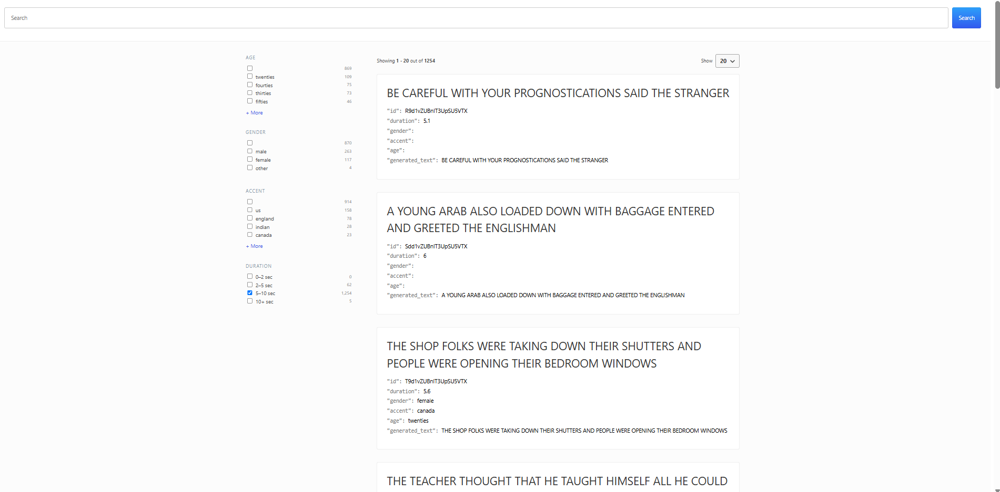

# xData test documentation

## Task 2

### Task 2C
Install ffmpeg into the system.

**Windows**: Download from official ffmpeg website (https://www.ffmpeg.org/), Add ffmpeg into system path \
**Ubuntu/Linux**: ``` sudo apt install ffmpeg ``` \
**MacOS**: ``` brew install ffmpeg ```

To start server, run
```
python3 asr_api.py
```

Test command:
```shell
curl -F 'file=@/home/advaitaa/cv-valid-dev/sample-000000.mp3' http://localhost:8001/asr
```

### Task 2D
Based on the requirement, I assumed that the asr api only accepts a single file input param. Hence, I did not implement batch inference. (But if I were to implement batch inference, I would change the api to accept multiple files). Due to this, the processing of the files were slow, even though I used multi-threading to parallelise the api calls.

To run the flask server in a multi threaded way, I used gunicorn since Flask by defult can only serve 1 request at a time and for 4000+ files that is not ideal. gunicorn can be used in Linux/Mac but for Windows it needs WSL and cannot run directly on Windows.

I have 8 CPU cores, and to not max out the cores, I decided to start it with 3 worker processes that can handle 2 threads in parallel so it is 6 total requests. --preload loads the model before forking the workers. --timeout gives enough time for slow or large audio files.

1. To start the server, run
```
gunicorn -w 3 --threads 2 -b 0.0.0.0:8001 asr_api:app --preload --timeout 180
```
2. Then run ``` python3 cv-decode.py```

## Task 4
1. Run the python script ``` python3 cv-index.py``` to create the search index and to ingest the data from the csv files with mapping.
2. Run ``` docker-compose up -d ``` to start 2 node cluster elasticsearch services.
3. To verify if cv-transcriptions index is created, run ``` http://localhost:9200/_cat/indices ```
4. To verify if the documents exist in the index, run ``` http://localhost:9200/cv-transcriptions/_search ```
5. To verify mapping of the index, run ``` http://localhost:9200/cv-transcriptions/_mapping?pretty ```

## Task 5
### How I did the setup before containerisation (just FYI):
1. Download search-ui starter app:
```
curl https://codeload.github.com/elastic/app-search-reference-ui-react/tar.gz/master | tar -xz
 ```
2. Run ``` npm i ``` to install dependencies
3. Modify App.js according to my requirements. Used elastic search connector since the documentation has mentioned that App Search is deprecated.
4. Removed config folder as it is more relevant for App Search.

### After containerisation:
I used port 3001 instead of 3000 because there was some process running on it that I could not kill no matter what I tried.
1. In search-ui folder, run ``` docker-compose up --build ``` to build the docker and docker compose files.
2. Access the frontend site at ``` http://localhost:3000 ```
3. The user can search for any word/text in the main search bar and once they click search, they can see the results. Else, if they want to filter and search, they can select the facets at the left hand side of the screen to filter through factors like age, gender, accent and duration.
4. Here is a screenshot of what it looks like in local development: 

## References
1. ffmpeg audio file conversion and resampling: https://stackoverflow.com/questions/67880409/ffmpeg-how-to-resample-audio-file
2. Soundfile python library: https://python-soundfile.readthedocs.io/en/0.13.1/#
3. Gunicorn: https://flask.palletsprojects.com/en/stable/deploying/gunicorn/
4. Thread Pool Executor Python: https://docs.python.org/3/library/concurrent.futures.html
5. Index, documents, fields Elasticsearch: https://www.elastic.co/guide/en/elasticsearch/reference/current/documents-indices.html
5. Data ingestion into Elastic Search Backend: https://betterstack.com/community/questions/import-csv-into-elasticsearch/, https://theaidigest.in/load-csv-into-elasticsearch-using-python/
6. Python icon: https://www.flaticon.com/free-icons/python
7. Search-UI: https://www.elastic.co/guide/en/search-ui/current/overview.html
8. Elasticsearch Guide: https://medium.com/data-science/mastering-elasticsearch-a-beginners-guide-to-powerful-searches-and-precision-part-1-87686fec9808
9. Elasticsearch Mapping: https://www.elastic.co/guide/en/elasticsearch/reference/current/mapping.html
